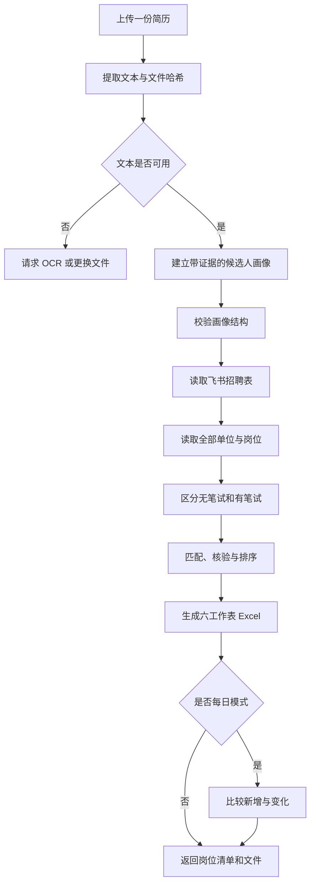

# 🚀 云招聘表岗位智能筛选 Skill｜v1.1.0 大更新

> **这次不是简单修补，而是一次核心能力升级：从“读取一张招聘表”，升级为“两张招聘表互补筛选＋分类定向搜索＋岗位链接深度核验”。**

上传一份简历，它就会动态建立属于当前用户的候选人画像，再从两张持续更新、彼此互补的飞书招聘表中寻找真正符合条件的岗位。央国企、事业单位、民企、外企、上市公司、人才引进、教育系统、医疗单位、高校、高职大专、行政/助理岗位，都可以按需求筛选。

## 🔥 这次大更新加入了什么？

### 1. 从单表筛选升级为“双表互补”

- **综合招聘表**：覆盖央国企、事业单位、民企、外企、上市公司等广泛岗位；
- **分类编制表**：重点补充事业单位、人才引进、教育、医疗、高校、高职大专、行政/助理及央国企岗位；
- 两张表发现同一岗位时会自动去重，但保留全部来源，避免重复，也尽量避免遗漏。

### 2. 用户可以按自己的求职目标自由选择

- 想尽量不漏岗位：选择 **两表互补**；
- 只关注企业招聘：选择 **综合招聘表**；
- 只想找编制、学校或医院：选择 **分类编制表**；
- 目标明确时，还能只筛选“高校人才引进”“行政/助理/工作人员”“教师招聘”等具体分类。

### 3. 表格没写清楚，Skill 会继续点进链接核验

以前一条岗位如果只写了标题和链接，很容易被漏掉。现在，只要学历、专业、届次、地点、截止时间、岗位职责、编制性质、笔试方式或报名条件没有说明白，Skill 就会继续打开公告、附件或报名页面核对，再与用户简历逐项比较。

链接仍无法确认的信息会明确标记为“待确认”，不会凭岗位名称猜测，也不会把“没有写笔试”误当成“无笔试”。

### 4. 每个人得到的结果都不同

Skill 不内置任何固定求职者信息，也不会套用开发者简历。它始终以用户本次上传的 PDF、DOCX、TXT 或 Markdown 简历为准，提取教育、专业、技能、项目、科研、获奖和工作经历，并为每条岗位建议保留简历原文证据。

### 5. 结果不只是岗位列表，而是一份可执行的求职清单

它会生成固定六工作表 Excel，区分：

- 当前最值得投递的无笔试岗位；
- 无笔试完整清单；
- 已截止或届次不符岗位；
- 有笔试及笔试待确认岗位；
- 每条建议对应的简历证据；
- 每日新增、截止日期、招聘状态和链接变化。

## ⚡ 30 秒安装

### 直接下载可导入安装包

## **[👉 点击这里下载最新版 Skill 安装包](https://github.com/siyunhao2025-beep/job-is-coming-good-luck/raw/refs/heads/main/screen-state-owned-jobs-import-v2.zip)**

下载后只需三步：

1. **不要解压；**
2. **不要改文件名；**
3. 在 ChatGPT 的“导入技能”窗口中，直接上传下载好的 `screen-state-owned-jobs-import-v2.zip`。

> ⚠️ **不要点击 GitHub 绿色的 `Code → Download ZIP`。** 那个按钮下载的是整个源代码仓库，不是可以直接导入 ChatGPT 的 Skill 安装包。

如果直接链接没有触发下载，也可以在仓库文件列表中点击 `screen-state-owned-jobs-import-v2.zip`，进入文件页面后，再点击右上角的 **Download raw file（下载原始文件）** 图标。

安装包已经按照 ChatGPT Skill 导入结构整理完成，包含运行所需的 `SKILL.md`、`agents/`、`assets/`、`references/` 和 `scripts/`，不包含任何用户简历、个人资料或历史筛选结果。

## 一句话理解

你给它一份简历，它会按你的选择读取一张表或同时读取两张互补表，并帮你回答四个问题：

1. 云招聘表中哪些岗位与我真正匹配，不论它来自央国企、事业单位还是私企？
2. 哪些岗位在飞书表中标记为无笔试？
3. 哪些岗位现在值得优先投，哪些已经截止或仍需核验？
4. 与上一次运行相比，今天新增或变化了哪些岗位？

## 它能做什么

### 1. 动态读取简历

- 支持 PDF、DOCX、TXT、Markdown 简历。
- 提取简历文本、文件哈希、联系方式和章节线索。
- 将教育经历、专业、技能、课程、项目、科研成果、获奖和工作经历整理为统一画像。
- 每一条用于岗位匹配的判断都要保留简历原文证据。
- 不从聊天记忆、文件名或旧候选人数据中猜测个人信息。
- 当简历缺少毕业届次、学历、专业或目标地区时，保留为空并标记“待确认”，不会擅自补齐。

### 2. 筛选云表中的全部类型岗位

- 默认读取两张互补飞书招聘表中的相关岗位和全部单位性质。
- 支持央国企、事业单位、民企、外企、上市公司及云表中出现的其他类型。
- 用户可设置 `JOB_NATURE_SCOPE`，只筛选指定单位性质；未设置时默认为 `全部`。
- 根据简历动态识别地区、届次、学历、专业和岗位方向。
- 按“公司 + 岗位 + 地点 + 届次/批次”跨表去重，不误合并不同地点、批次或岗位。
- 可结合官方公告核验岗位是否仍开放、单位性质、学历、届次、地点和专业要求。
- 不会因为某个岗位来自民企、外企或其他非国有单位而自动降低其匹配等级。

### 2.1 两张表如何互补

| 数据源 | 更适合找什么 | 使用特点 |
| --- | --- | --- |
| 综合招聘表 | 央国企、事业单位、民企、外企、上市公司等广泛岗位 | 单位性质覆盖广，并保留原有“/ = 无笔试”口径 |
| 分类编制表 | 事业单位、人才引进、教育、医疗、高校、高职大专、行政/助理/工作人员及央国企岗位 | 分类更细，适合按求职方向进入对应标签和子视图 |

默认采用“**两表互补**”：两张表都查，统一字段后去重，并保留每条岗位来自哪张表。用户也可以为了节省时间只查一张表，或只查分类编制表中的某些分类。

分类编制表目前可按以下入口选择：

- 事业单位汇总：全部、人才引进；
- 教育系统：教师汇总、人才引进；
- 医疗单位、医院招聘：表格、人才引进；
- 高校：全国院校、本科院校、高职大专、人才引进、行政/助理/工作人员等；
- 央国企招聘信息。

如果用户没有明确选择，Skill 会根据简历和目标岗位自动选择相关分类，并将容易交叉的相邻分类一并检查。例如，高校科研助理可能同时出现在“高校”和“事业单位”入口中。

### 2.2 表内没写清楚时，必须点开链接

岗位标题或表格摘要不足以判断是否合适时，Skill 不能直接跳过。只要记录附有公告、报名、附件或官网链接，就应点开核对可能改变资格判断的信息，包括岗位职责、编制/单位性质、地点、截止时间、学历、专业、届次、年龄、政治面貌、资格证、工作经历、笔试安排和报名方式。

判断资格时，以官方招聘公告及附件为最高依据，其次是官方报名系统和单位/政府招聘页面，最后才是表格摘要。链接无法打开或内容仍不清楚时，相关字段标记为“待确认”，不能猜测。分类编制表没有写“是否笔试”时，也不能沿用综合表的“/ = 无笔试”规则。

### 3. 严格区分有无笔试

本 Skill 保留飞书表中的原始口径：

- `/` 表示“无笔试”；
- `有笔试` 表示“有笔试”。

官网信息可以用于核验岗位是否仍开放，但不能反过来覆盖飞书表的笔试字段。这样可以避免模型把 `/` 错误理解为“未知”。

### 4. 给岗位排序并生成行动建议

岗位会按匹配分、招聘状态、地区和届次计算行动分，并分为 S、A、B、C 四档：

| 档位 | 匹配分 | 含义 |
| --- | ---: | --- |
| S | 90–100 | 高度匹配，优先核验并投递 |
| A | 85–89 | 匹配较高，建议重点关注 |
| B | 70–84 | 基本匹配，需检查限制条件 |
| C | 0–69 | 匹配较弱或关键信息不足 |

行动建议统一为：

- `在招`：今天投递；
- `待确认` 或 `条件性`：先确认入口，开放就投；
- 已截止、届次不符等：不投旧批次，仅关注后续更新。

### 5. 生成固定结构的六工作表 Excel

输出文件名：

```text
云招聘表岗位筛选_{候选人姓名}_{运行日期}.xlsx
```

Excel 中的六个工作表名称和顺序保持不变：

| 顺序 | 工作表 | 用途 |
| ---: | --- | --- |
| 1 | 无笔试优先投递 | 放置当前最值得行动的岗位，并给出行动分和建议 |
| 2 | 无笔试完整清单 | 保留飞书表中所有无笔试相关岗位 |
| 3 | 无笔试但已截止 | 单独保存旧批次、已截止或地区/属性不符岗位 |
| 4 | 有笔试备选 | 与无笔试岗位分开，作为次级选择 |
| 5 | 简历匹配口径 | 展示每项岗位建议所依据的简历原文证据 |
| 6 | 每日监测规则 | 记录候选人画像、筛选规则和后续变化比较口径 |

工作表的名称、列名、公式、颜色、列宽、行高、冻结窗格和表名由 `references/workbook-spec.md` 固定约束，不能随意改动。

### 6. 比较每日变化

开启每日模式后，Skill 会用“公司 + 岗位 + 地点 + 届次/批次”作为比较键，检查：

- 新增岗位；
- 截止日期变化；
- 招聘状态变化；
- 投递链接变化；
- 公告链接变化。

提醒优先级为：截止 7 天内 > 新增无笔试 > 待确认转为在招 > 其他变化。

## 使用前需要准备什么

至少准备以下两项：

1. 一份可读取的个人简历：PDF、DOCX、TXT 或 Markdown；
2. 使用内置的两张默认飞书表，或提供自定义招聘表链接，并确保当前 ChatGPT/Codex 会话拥有读取权限。

如果要执行每日对比，再准备上一次生成的 Excel 或结构化结果。

如果 PDF 是扫描图片而不是可搜索文本，还需要 OCR 能力；否则建议改传文字可选中的 PDF 或 DOCX。

## 最简单的使用方法

### 方法一：在 ChatGPT/Codex 中直接调用

1. 安装或导入仓库中的 `screen-state-owned-jobs` 文件夹。
2. 在同一条消息中上传一份简历。
3. 使用内置两张默认表，或提供有权访问的自定义飞书招聘表链接。
4. 明确本次是否需要每日对比，以及是否有单位性质、地区、城市、岗位方向等补充偏好。
5. 按需要选择数据源：两表互补、仅综合招聘表、仅分类编制表或自定义；使用分类编制表时还可指定分类。
6. 在消息中使用 `$screen-state-owned-jobs` 调用 Skill。

可以直接复制下面的提示词：

```text
请使用 $screen-state-owned-jobs 读取我本次上传的简历，并筛选下面飞书云招聘表中的全部岗位：

飞书表链接：<粘贴链接>
运行日期：2026-08-21
每日模式：否
单位性质：全部
优先要求：优先无笔试；目标地区为江苏、上海和广东；缺少的信息请标记“待确认”，不要猜测。

请生成固定六工作表的 Excel，并在回复中列出最值得优先投递的岗位及对应简历证据。
```

### 方法二：首次运行，不指定个人偏好

```text
请使用 $screen-state-owned-jobs，根据我刚上传的简历动态建立候选人画像，然后筛选这张飞书云招聘表中的全部单位岗位：<链接>。

不要使用聊天记忆或任何固定候选人资料。简历没有写明的地区、专业认证和毕业届次一律留空或标记“待确认”。完成后生成六工作表 Excel。
```

### 方法三：进行每日变化监测

```text
请使用 $screen-state-owned-jobs，以我本次上传的简历为准重新筛选：<飞书表链接>。

DAILY_MODE=true。上一版结果已经上传。请比较新增岗位、截止日期、招聘状态、投递链接和公告链接的变化；优先报告截止 7 天内和新增无笔试岗位。
```

### 方法四：明确修正简历中没有写出的偏好

```text
请使用 $screen-state-owned-jobs 筛选岗位。我的简历已经上传。

补充偏好仅作为本次用户修正：
- 单位性质：民企、外企和上市公司；
- 目标地区：北京、上海、江苏；
- 目标方向：数据分析、遥感、空间天气、科研管理；
- 优先无笔试：是。

这些补充信息请标记为 user_override，不要伪装成简历原文。
```

### 方法五：按求职需求选择两张表和分类

如果希望尽量不漏岗位，使用默认的两表互补：

```text
请使用 $screen-state-owned-jobs 读取我上传的简历。
SOURCE_MODE=两表互补；CATEGORY_SCOPE=自动选择；LINK_VERIFICATION_MODE=必要时逐链接核验。
请合并两张默认飞书表，去重时保留全部来源；凡表内条件不足但带有链接的岗位，请点开公告或报名页后再判断是否符合简历。
```

如果目标很明确，也可以只查所需分类：

```text
请使用 $screen-state-owned-jobs 读取我上传的简历。
SOURCE_MODE=分类编制表；CATEGORY_SCOPE=高校：人才引进、行政/助理/工作人员等；LINK_VERIFICATION_MODE=必要时逐链接核验。
其他分类本次不查，并在结果中说明跳过了哪些分类。
```

## Skill 的运行逻辑



## 输入参数说明

| 参数 | 是否必需 | 说明 |
| --- | --- | --- |
| `RESUME_FILE` | 是 | 当前用户上传或明确指定的简历 |
| `FEISHU_URL` | 否 | 兼容旧版的单张招聘表链接；不填时按 `SOURCE_MODE` 使用内置表 |
| `FEISHU_URLS` | 否 | 多张招聘表链接；默认包含两张内置互补表 |
| `SOURCE_MODE` | 否 | `两表互补`（默认）、`综合招聘表`、`分类编制表`、`自定义` |
| `CATEGORY_SCOPE` | 否 | 分类编制表的分类/子视图；默认根据简历自动选择 |
| `LINK_VERIFICATION_MODE` | 否 | 默认 `必要时逐链接核验`；仅在用户明确要求时使用 `仅表内信息` |
| `RUN_DATE` | 是 | 运行日期，格式为 `YYYY-MM-DD` |
| `PREVIOUS_RESULT` | 否 | 上一次结构化结果或 Excel，用于每日比较 |
| `DAILY_MODE` | 否 | 是否开启每日变化比较 |
| `JOB_NATURE_SCOPE` | 否 | 单位性质筛选，默认 `全部`；可指定央国企、事业单位、民企、外企等云表实际值 |
| `PREVIOUS_RESUME_PROFILE` | 否 | 上一次已校验的标准化画像 |
| `ALLOW_PROFILE_REUSE` | 否 | 是否明确允许复用旧画像，默认 `false` |
| `PROFILE_OVERRIDES` | 否 | 用户当次补充或更正的偏好与事实 |

简历来源优先级严格如下：

1. 当前消息新上传的简历；
2. 当前消息明确指定的 `RESUME_FILE`；
3. 仅在 `ALLOW_PROFILE_REUSE=true` 时复用带来源哈希的旧画像；
4. 以上均没有时，停止筛选并要求上传简历。

如果同时上传了多份简历但没有说明用哪一份，Skill 应先询问，不能自动拼接。

单位性质的默认规则也很简单：未填写、留空或填写 `全部`，就筛选云表中的所有单位；只有用户明确指定时，才缩小到央国企、事业单位、民企、外企等某一类或几类。技术调用名 `$screen-state-owned-jobs` 为兼容旧版本而保留，不代表只能筛选国企岗位。

## 本地运行简历解析器

仓库内置的脚本只负责稳定的简历文本提取与画像结构校验；语义画像构建、飞书读取、岗位核验和 Excel 生成由调用 Skill 的智能体完成。

### 1. 安装依赖

```bash
python -m pip install -r requirements.txt
```

### 2. 解析简历

```bash
python screen-state-owned-jobs/scripts/parse_resume.py "我的简历.pdf" \
  --output "outputs/job-screening/2026-08-21/resume/resume_parse.json" \
  --text-output "outputs/job-screening/2026-08-21/resume/resume_text.txt"
```

返回状态：

- `success`：文本足够，可以继续建立画像；
- `needs_ocr`：提取到的非空白字符少于 80 个，需要 OCR；
- `error`：文件缺失、损坏、加密、为空或格式不支持。

### 3. 校验标准化画像

根据 `references/profile-schema.md` 建立 `resume_profile.json` 后运行：

```bash
python screen-state-owned-jobs/scripts/validate_profile.py \
  "outputs/job-screening/2026-08-21/resume/resume_profile.json"
```

只有校验成功后才能继续岗位排序，防止缺字段或无证据的数据进入最终 Excel。

## 常见错误与处理办法

| 错误代码 | 含义 | 处理办法 |
| --- | --- | --- |
| `RESUME_REQUIRED` | 没有找到简历文件 | 重新上传并明确指定文件 |
| `UNSUPPORTED_FORMAT` | 格式不支持 | 改为 PDF、DOCX、TXT 或 Markdown |
| `EMPTY_FILE` | 文件为空 | 上传完整简历 |
| `PDF_UNREADABLE` | PDF 加密、损坏或无法读取 | 解除密码或另存为正常 PDF/DOCX |
| `DOCX_UNREADABLE` | DOCX 损坏或结构异常 | 用 Word 重新另存为 DOCX |
| `OCR_REQUIRED` | 扫描件提取不到足够文字 | 使用 OCR，或上传文字可选中的文件 |
| `PROFILE_INVALID` | 候选人画像缺字段或证据 | 按画像规范补齐并重新校验 |

## 重要边界

- 本 Skill 提供云招聘表岗位整理和决策辅助，不保证录取，也不能替代招聘单位的最终资格审查。
- “匹配”表示简历信息与岗位要求相符或可能相符；证据不足时必须写“待确认”。
- 专业等同、应届身份、基层经历和资格证书不能凭研究方向或相似名称自动推断。
- 官方来源可以核验招聘状态和报名要求，但飞书表中的笔试字段保持原样。
- 默认不保存用户原始简历；只保存用户要求保留的标准化画像和结果文件。
- 不要把真实简历、手机号、邮箱、身份证号或生成结果提交到 GitHub。

## 项目结构

```text
screen-state-owned-jobs-skill/
├── README.md
├── requirements.txt
├── .gitignore
└── screen-state-owned-jobs/
    ├── SKILL.md
    ├── agents/
    │   └── openai.yaml
    ├── assets/
    │   └── icon.svg
    ├── references/
    │   ├── profile-schema.md
    │   └── workbook-spec.md
    └── scripts/
        ├── parse_resume.py
        └── validate_profile.py
```

## 各文件分别负责什么

- `SKILL.md`：定义完整运行顺序、数据源优先级、失败策略和最终输出要求。
- `profile-schema.md`：固定候选人画像字段和证据要求。
- `workbook-spec.md`：固定 26 字段岗位结构、排序规则和六工作表格式。
- `parse_resume.py`：从支持的简历格式中稳定提取文本并生成来源哈希。
- `validate_profile.py`：检查候选人画像是否满足稳定接口。
- `openai.yaml`：定义 Skill 在 ChatGPT/Codex 中显示的名称和默认调用提示。

## 隐私建议

本仓库只存放 Skill 逻辑，不应存放任何真实求职者简历或运行结果。`.gitignore` 已默认排除输出目录、Excel、标准化画像和提取文本。实际使用时，也应确认飞书表访问权限符合其数据管理要求。
